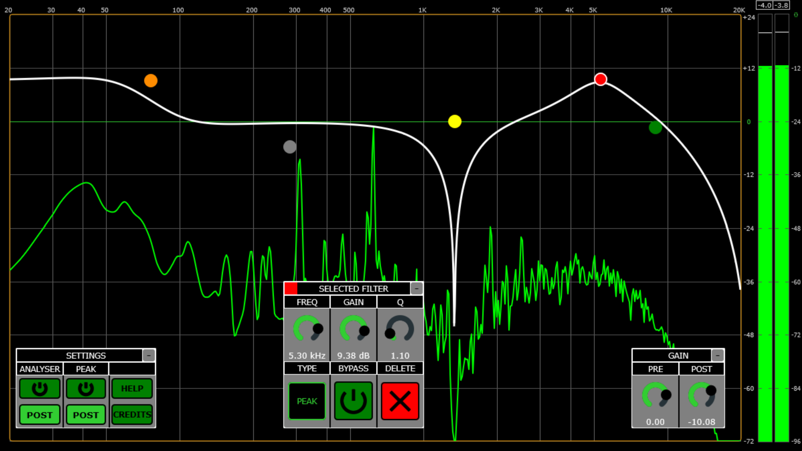
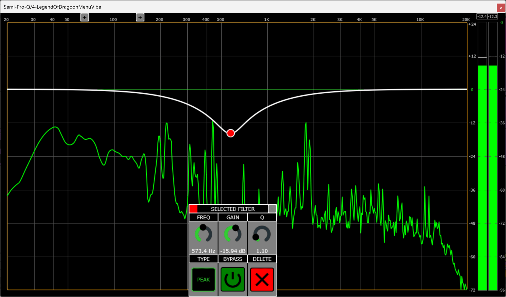

# Semi-Pro-Q


A professional-grade, feature-rich parametric EQ plugin built with JUCE. Semi-Pro-Q offers an intuitive drag-and-drop interface combined with powerful visualization tools for precise audio shaping.





## Features


- 🎛️ **12 simultaneous filter bands** with 8 filter types (Peak, Notch, High/Low Shelf, High/Low Resonant,  High/Low Butterworth 12-96 dB/oct)

- 🎨 **Drag-and-drop workflow** - Double-click to create, drag to adjust, right-click to delete

- 📊 **Real-time spectrum analyzer** with adaptive resolution and musical tilt compensation

- 📈 **Peak meters** with clip detection and hold indicators

- ⚡ **Zero-latency processing** with smooth parameter transitions

- 💾 **Persistent state** - All settings save with your project

- 🪟 **Minimizable, draggable panels** for flexible workspace layout





## Installation


### Pre-built Binary

1. Download the latest release from the [**GitHub Releases**](https://github.com/cwiggins12/TwelveBandEq/releases) page.  

2. Copy the plugin to your DAW's plugin folder:

&nbsp;  - **VST3:** `C:\Program Files\Common Files\VST3\` (Windows)  


### Building from Source


#### Requirements

- [JUCE Framework](https://juce.com/) (version 7.x or higher recommended)

- C++17 compatible compiler

- Projucer (included with JUCE)


#### Build Steps


1. Clone the repository:

```bash

git clone https://github.com/cwiggins12/TwelveBandEq.git

cd TwelveBandEq

```

2. Open `Semi-Pro-Q.jucer` in Projucer

3. Select your target platform and IDE (Visual Studio, Xcode, etc.)

4. Click "Save and Open in IDE"

5. Build the plugin in your IDE:

&nbsp;  - **Visual Studio:** Build → Build Solution

&nbsp;  - **Xcode:** Product → Build

6. The compiled plugin will be in the `Builds/\[Platform]/` directory


## Compatibility


### Plugin Format

- VST3


### DAWs (Tested)

- Ableton Live

- Studio One

- Reaper

### Operating Systems

- Windows

- Linux


## Quick Start


### Creating \& Editing Filters

- **Double-click** the grid to create a peak filter at that frequency/gain

- **Left-click** a filter to select it and edit via the Selected Filter panel

- **Drag** filters to adjust frequency and gain visually

- **Right-click** a filter to delete it instantly


### Selected Filter Panel

Shows all parameters when a filter is selected:

- **FREQ:** 20 Hz - 20 kHz

- **GAIN:** -72 dB to +24 dB

- **Q | dB/OCTAVE:** Bandwidth (switches based on filter type)

- **TYPE:** Choose from 8 filter types

- **BYPASS:** A/B compare | **DELETE:** Remove filter


### Visualizers

**Spectrum Analyzer** (default: ON, Post-EQ)

- Yellow = Pre-EQ | Green = Post-EQ

- Has 4.5 dB/oct tilt for better high-frequency display

- Scaled +12 dB relative to peak meters


**Peak Meters** (default: ON, Post-gain)

- Yellow = Pre-gain | Green = Post-gain  

- Click red clip indicators to clear them


### Components

- **Gain Panel:** PRE and POST gain knobs

- **Settings Panel:** Toggle analyzers and meters

- **Minimize:** Click top-right button on any panel

- **Reposition:** Drag panels anywhere (avoid sliders)

- **Reset:** Reset any slider by double clicking it

- All positions and settings auto-save with your project


## Technical Details


### Custom Filter Engine

A high-performance IIR filter implementation built from scratch:

- **Zero heap allocations** after construction - fully pre-allocated for real-time safety

- **Lock-free thread safety** using seqlock pattern (audio thread never blocks)

- **Per-sample coefficient smoothing** prevents clicks/pops on parameter changes

- **Optimized processing paths** - separate mono/stereo and smoothing/non-smoothing code

- **Direct Form II topology** with denormal protection and cascaded Butterworth stages
  
*For implementation details, see `Source/Utils/AudioProcessing.h`*


### Spectrum Analyser

Production-grade FFT analysis with adaptive resolution:

- **Cubic interpolation** (Catmull-Rom) for smooth bass display (<1 kHz)

- **RMS averaging** for high frequencies (>1 kHz) to prevent aliasing

- **4.5 dB/octave tilt** for better high-frequency visualization

- **Pre-computed scalars** - window loss, FFT scaling, and tilt baked per-bin

- **75% overlap processing** for temporal smoothing without CPU waste

- FFT: 8192 samples, 20 Hz - 20 kHz, 30 FPS updates

*For implementation details, see `Source/Components/Visualization/SpectrumAnalyserComponent.cpp`*


### Architecture

- **JUCE Framework 7.x** for cross-platform support

- **Custom UI components** to reduce overhead

- **Lock-free communication** between audio and GUI threads

- **Signal chain:** Input → Pre-Gain → [12 Filters] → Post-Gain → Output


## License


MIT License - See [LICENSE](LICENSE) file for details.


This project is free to use, modify, and distribute. Attribution appreciated but not required.


## Support


Having issues? Check these first:

- Ensure your DAW supports VST3/AAX plugins

- Verify the plugin is in the correct folder

- Try rescanning plugins in your DAW

- Check that your system meets your DAW's minimum requirements


Still having problems? [Open an issue](../../issues) with:

- DAW name and version

- Operating system

- Plugin format (VST3/AAX)

- Description of the problem

- Steps to reproduce


---


## Author


**Cody Wiggins**  

📧 codywigginsdev@gmail.com  

🌐 [Development Blog](https://codywigginsdev.neocities.org/) - Weekly updates about what I am developing


*Thanks for using Semi-Pro-Q! Happy mixing :)*


## Screenshots


### Main Interface


### Filter Selection


### Customizable Configuration


